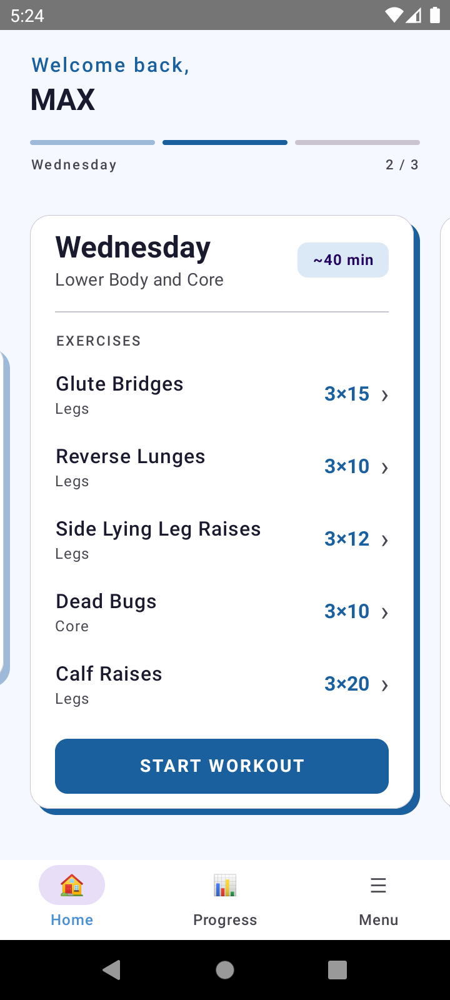
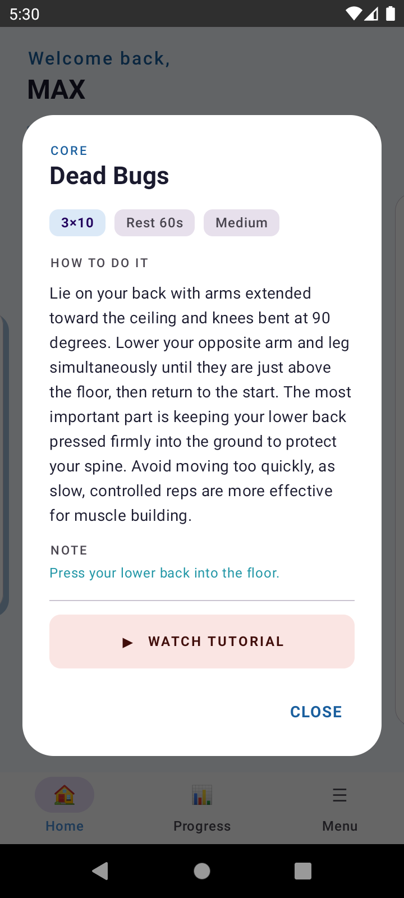
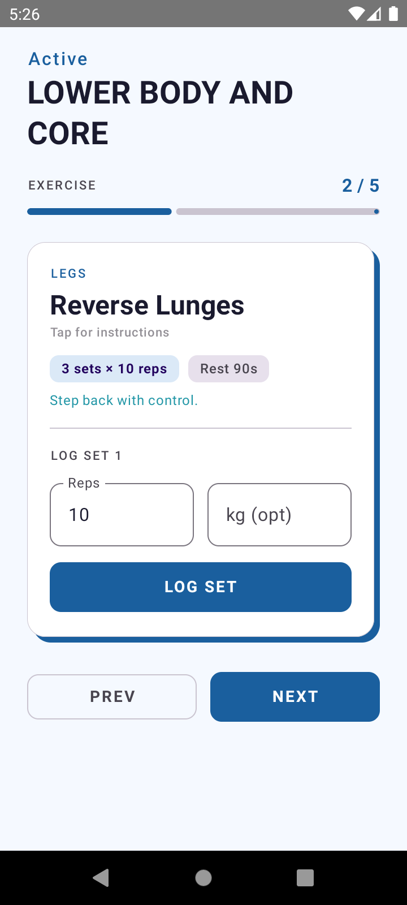
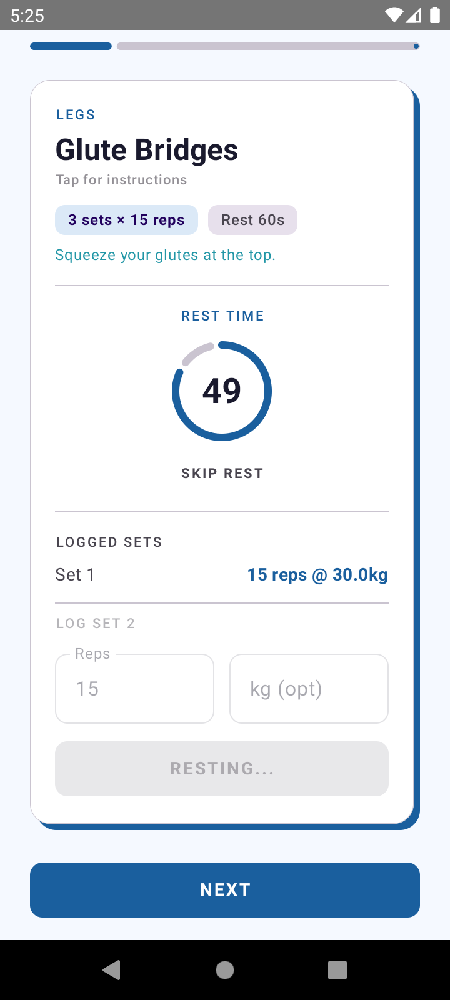
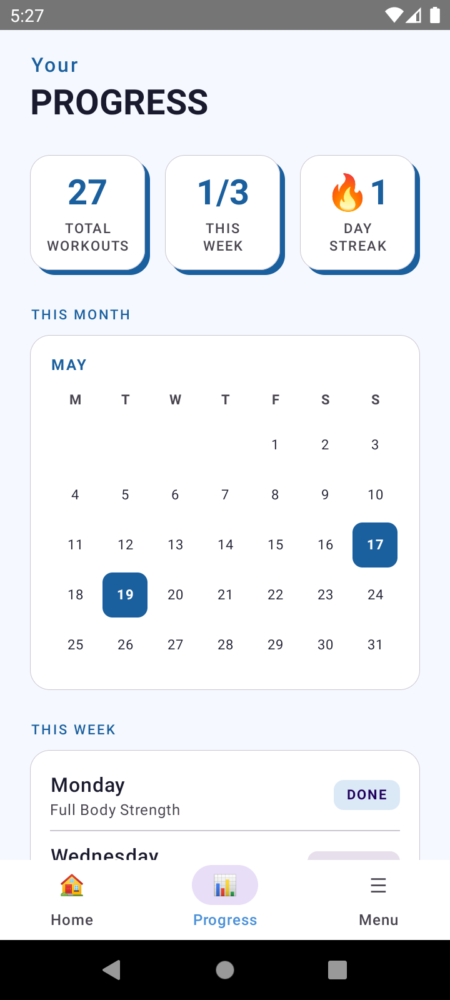
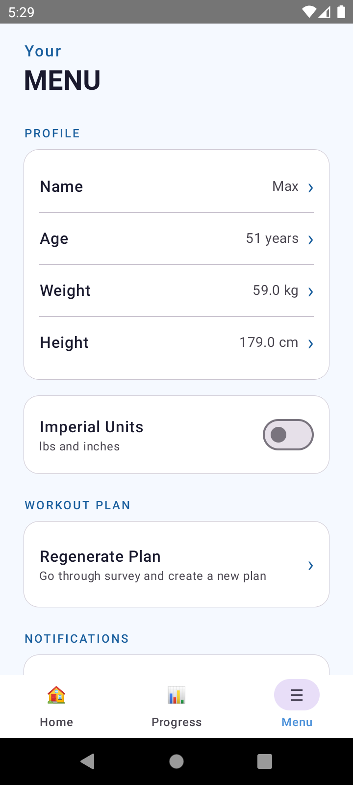
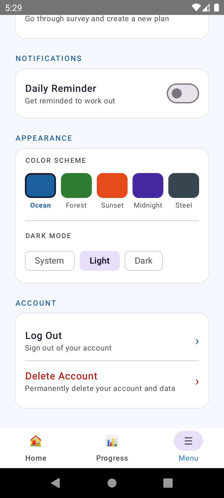

# 💪 Personal Trainer


A cross-platform fitness app built with **Kotlin Multiplatform** and **Compose Multiplatform**, running natively on both Android and iOS from a single shared codebase.

The app uses AI to generate personalized workout plans, tracks progress, and adapts over time based on the user's goals and performance.

---

## Screenshots

### Home
| Workout Card | Exercise Details |
|---|---|
|  |  |

### Active Workout
| Exercise Logging | Rest Timer |
|---|---|
|  |  |

### Progress & Menu
| Progress | Menu (top) | Menu (bottom) |
|---|---|---|
|  |  |  |

---

## Features

- 🤖 **AI-generated workout plans** via Google Gemini API — personalized to your goal, fitness level, and available equipment
- 📅 **Weekly plan with swipeable cards** — browse upcoming and completed workout days
- 🏋️ **Active workout screen** — step through exercises, log sets/reps/weight, built-in rest timer, edit logged sets
- 📊 **Progress tracking** — session history, streak counter, monthly workout calendar
- 🔐 **Firebase Authentication** — email/password login and registration
- 👤 **Guest mode** — try the app without creating an account, data persists across relaunches
- ☁️ **Firestore sync** — user data and plans sync across devices
- 🎨 **5 color schemes + dark mode** — Ocean, Forest, Sunset, Midnight, Steel, with system/manual override
- 🔔 **Smart notifications** — reminders fire only on scheduled workout days, reschedule after reinstall
- 📱 **Offline support** — local storage with seamless remote sync and offline banner
- 🔄 **Auto plan regeneration** — new plan generated automatically when the week completes
- 💥 **Crash reporting** — Firebase Crashlytics on Android and iOS

---

## Tech Stack

| Layer | Technology |
|---|---|
| **UI** | Compose Multiplatform (shared for Android + iOS) |
| **Language** | Kotlin |
| **Architecture** | MVVM + Repository pattern |
| **AI** | Google Gemini API via Ktor REST |
| **Auth** | Firebase Authentication (gitlive-firebase) |
| **Remote DB** | Firebase Firestore |
| **Local storage** | Multiplatform Settings |
| **Networking** | Ktor Client (OkHttp/Darwin) |
| **Serialization** | Kotlinx Serialization |
| **Navigation** | Jetpack Navigation Compose (KMP) |
| **DI** | Manual (constructor injection) |
| **Notifications** | AlarmManager (Android) / UNUserNotificationCenter (iOS) |
| **Crash reporting** | Firebase Crashlytics |
| **CI/CD** | GitHub Actions |

---

## Architecture

```
composeApp/
├── commonMain/          # Shared Kotlin + Compose UI (both platforms)
│   ├── data/
│   │   ├── model/       # User, WorkoutPlan, Exercise, WorkoutSession
│   │   ├── repository/  # GeminiRepository, FirestoreRepository, LocalRepository, AuthRepository
│   │   └── remote/      # Ktor HTTP client, Gemini API models, prompt builder
│   ├── presentation/
│   │   ├── auth/        # Login / Register / Guest mode
│   │   ├── onboarding/  # 4-step survey + plan generation loading
│   │   ├── home/        # Next workout card with swipeable days
│   │   ├── workout/     # Active session, exercise logging, rest timer, set editing
│   │   ├── progress/    # Stats, calendar, session history
│   │   ├── menu/        # Profile, appearance, notifications, account
│   │   ├── splash/      # Auth state check + Firestore sync
│   │   └── theme/       # Color schemes, dark mode preferences
│   ├── navigation/      # NavGraph with type-safe routes
│   └── utils/           # expect/actual: time, date, insets, network, notifications, URL opener
├── androidMain/         # Android-specific implementations
├── iosMain/             # iOS-specific implementations
└── jvmMain/             # JVM stubs for unit testing
```

---

## CI/CD

The project uses GitHub Actions for automated testing and building.

**`test.yml`** — runs on every push to `main`:
- Spins up Ubuntu VM
- Runs all 41 unit tests via `./gradlew :composeApp:jvmTest`
- Reports pass/fail on every commit

**`build.yml`** — runs only if tests pass:
- Builds a signed release AAB
- Uploads as a downloadable artifact (retained 30 days)
- Ready to upload directly to Google Play

---

## Testing

Unit tests for core business logic, runnable on JVM:

```bash
./gradlew :composeApp:jvmTest
```

**41 tests, 100% passing:**
- `WorkoutViewModelTest` — 21 tests: exercise navigation, set logging, rest timer, edge cases, negative scenarios, out of bounds handling
- `PlanPromptBuilderTest` — 12 tests: prompt generation, user data inclusion, schema validation
- `AppViewModelTest` — 4 tests: plan generation success/error states, local persistence, Gemini call count verification (uses MockK)
- `LocalRepositoryTest` — 3 tests: user persistence, guest mode save/clear
- `ComposeAppCommonTest` — 1 test: basic sanity check

Testing approach:
- Pure unit tests for classes with no external dependencies
- MockK for mocking network layer (GeminiRepository, FirestoreRepository)
- Real in-memory storage (PropertiesSettings) for repository tests
- TestScope injection for testing ViewModel coroutines

---

## Key Engineering Decisions

**Single shared UI** — Compose Multiplatform for all screens. Platform-specific code is limited to `expect/actual` declarations for system APIs (notifications, network, date formatting, URL opening).

**Local-first with remote sync** — Data loads instantly from local storage (Multiplatform Settings), then syncs from Firestore in the background. No loading spinners on app launch for returning users.

**Guest mode** — Full app functionality without an account. Guest state persists across relaunches via local storage. Upgrade prompts appear after first workout and in the Menu.

**AI prompt engineering** — Gemini receives a structured prompt with user profile data and returns a strict JSON schema. The response is parsed and validated before display. Includes retry logic and quota error handling.

**Theme system** — Five `ColorScheme` presets defined as Material3 `lightColorScheme`/`darkColorScheme` pairs. Selected scheme is persisted and resolved at the root `MaterialTheme` level, so every composable automatically reflects changes.

**Notification scheduling** — Per-day alarms using actual workout schedule (not daily). Alarms are rescheduled weekly after firing, and persist across device reboots via `BOOT_COMPLETED` broadcast on Android.

**Security** — API keys stored in `local.properties` (gitignored) and GitHub Secrets for CI. Git history cleaned to remove any previously exposed keys.

---

## Getting Started

### Prerequisites
- Android Studio Ladybug or later
- Xcode 15+ (for iOS)
- JDK 17
- CocoaPods (`gem install cocoapods`)

### Setup

1. **Clone the repo**
```bash
git clone https://github.com/Froyder/PersonalTrainer.git
cd PersonalTrainer
```

2. **Add your API keys**

Create `local.properties` in the project root:
```properties
gemini_api_key=YOUR_GEMINI_API_KEY
```

Get a free Gemini API key at [aistudio.google.com](https://aistudio.google.com)

Both platform-specific API config files are gitignored and must be created manually:

**Android** — create `composeApp/src/androidMain/kotlin/com/froyder/personaltrainer/data/remote/ApiConfig.android.kt`:

    package com.froyder.personaltrainer.data.remote
    import com.froyder.personaltrainer.BuildConfig
    actual fun getGeminiApiKey(): String = BuildConfig.GEMINI_API_KEY

This reads the key from `local.properties` via `BuildConfig` — no hardcoded value needed.

**iOS** — create `composeApp/src/iosMain/kotlin/com/froyder/personaltrainer/data/remote/ApiConfig.ios.kt`:

    package com.froyder.personaltrainer.data.remote
    actual fun getGeminiApiKey(): String = "YOUR_GEMINI_API_KEY_HERE"

Replace `YOUR_GEMINI_API_KEY_HERE` with your actual key.

3. **Add Firebase config files**
- Place `google-services.json` in `composeApp/`
- Place `GoogleService-Info.plist` in `iosApp/iosApp/`

Create a Firebase project at [console.firebase.google.com](https://console.firebase.google.com) with:
- Authentication (Email/Password enabled)
- Firestore Database
- Crashlytics enabled

4. **Install iOS dependencies**
```bash
cd iosApp
pod install
```

5. **Run**
- **Android** — open in Android Studio, run on device/emulator
- **iOS** — open `iosApp/iosApp.xcworkspace` in Xcode, run on simulator

---

## What I Learned

This project was built as a deep dive into Kotlin Multiplatform in a real-world context. Key takeaways:

- **KMP maturity** — The ecosystem is production-ready for business logic and networking. Compose Multiplatform for UI is solid on Android and iOS, with some platform quirks around system APIs.
- **expect/actual** — Powerful but requires discipline. Keeping platform implementations thin and pushing logic into `commonMain` is the right approach.
- **Firebase on KMP** — The gitlive-firebase wrapper works well but iOS requires CocoaPods integration, which adds friction to the build setup.
- **Compose state management** — Single source of truth via `StateFlow` + `collectAsState()` scales cleanly across a multi-screen app.
- **AI integration** — Prompt engineering matters. Strict JSON schema instructions and response cleaning (stripping markdown fences) are essential for reliable parsing.
- **Testing in KMP** — Running common tests on JVM requires JVM actuals for all `expect` declarations. MockK and TestScope injection work well for ViewModel testing.
- **CI/CD** — GitHub Actions with secrets management keeps the build pipeline clean and reproducible without exposing sensitive credentials.
- **Security** — API keys require active git history cleaning if accidentally exposed — `.gitignore` alone is not enough after a commit.

---

## Roadmap

- [x] Google Play internal testing
- [ ] Google Play production release
- [ ] App Store (iOS) release
- [ ] Weight progress chart
- [ ] Custom exercise builder
- [ ] Multiple concurrent plans
- [ ] Workout sharing / social features
- [ ] Apple Watch / Wear OS companion
- [ ] Localization (multiple languages)
- [ ] Increase test coverage

---

## License

MIT License — feel free to use this as a reference or starting point for your own KMP project.